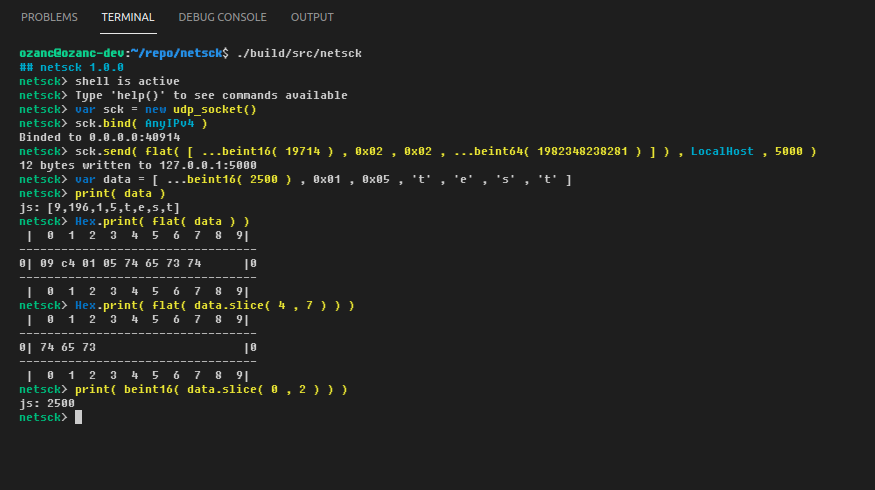

<p align="center">
  
  
  
  
  <a href="https://github.com/OzanCansel/netsck/actions/workflows/cmake-gcc-ubuntu-2004.yml">
    
  </a>
</p>

# netsck
`netsck` is a network utility tool which is developed to prototype or test network things. It provides a shell inside which runs javascript engine. Makes posible to create, bind, send data through or receive data from a socket. Current only `udp_socket` is implemented.

- It is a terminal application.

- Depends on `QtQml`, `QtNetwork` and `QtCore`.

- Qt 5.12.8 and greater

- GCC 7.3.1 and greater

- Currently tested only on Linux but should work for Windows too.

Note that, __netsck__ uses ansi color codes to colorize the terminal. On Windows, it is disabled by default so if you want to have a better look, you should enable virtual terminal with :
```
[HKEY_CURRENT_USER\Console]
"VirtualTerminalLevel"=dword:00000001
```

## Documentation
In doc folder [man pages](https://github.com/OzanCansel/netsck/blob/master/doc) and [merged-pdf](https://github.com/OzanCansel/netsck/blob/master/doc/netsck-js-api.pdf) version of man pages exist.

Man pages are accessible from __netsck__ in application, so just type `help()` to the console.
On Linux, man pages are embedded.
On Windows, __netsck__ tells to the explorer.exe to open [merged-pdf](https://github.com/OzanCansel/netsck/blob/master/doc/netsck-js-api.pdf) version.

## Usage
Create udp echo server

``` Javascript
var srv = new udp_socket()
srv.bind( AnyIPv4 , 10000 )
srv.enable_stdout( false )

while( wait_key( 30 ) != Key.ESC )
{
    srv.wait_a_bit()
    
    while ( srv.has_datagram() )
    {
        var dgram = srv.read_datagram()
        
        Hex.print( dgram.data )
        
        srv.send(
            dgram.data ,
            dgram.sender_addr ,
            dgram.sender_port
        )
    }
}
```
Create udp client

``` Javascript
var cli = new udp_socket()

cli.send(
    "Hello, u there ?" ,
    "127.0.0.1" ,
    10000
)

cli.send(
    flat(
        [ 0x01 , 0x05 , 0x14 , ...beint32( 12345 ) , ...lefloat( 14.2 ) ]
    ) ,
    "127.0.0.1" ,
    10000
)
```

## How to build ?
### On Ubuntu 18.04 or 20.04

```bash
git clone https://github.com/OzanCansel/netsck.git
cd netsck
git submodule update --init
mkdir build && cd build
cmake ..
sudo cmake --build . --target install -- -j$(nproc)
```

## Contributing
Pull requests are welcome. For major changes, please open an issue first to discuss what you would like to change.

Please make sure to update tests as appropriate.

## License
[MIT](https://raw.githubusercontent.com/OzanCansel/netsck/master/LICENSE)
